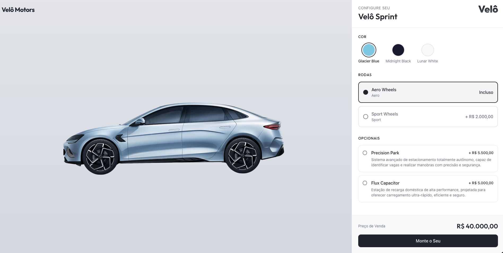

<div align="center">



# Velô Sprint

**Configurador de Veículo Elétrico**

React · TypeScript · Vite · Supabase

</div>

---

## Sobre

SPA para configuração e compra do **Velô Sprint** — veículo elétrico de alta performance.

- Personalize cores, rodas e opcionais
- Cálculo de preço em tempo real
- Análise de crédito automatizada
- Consulta de status do pedido

> **Especificações:** 450 km de autonomia · 0–100 km/h em 3,2s · 500 cv

---

## Stack

| Camada | Tecnologias |
|--------|-------------|
| **Frontend** | React 18, TypeScript, Vite, Tailwind CSS, shadcn/ui |
| **Estado** | Zustand, React Hook Form |
| **Validação** | Zod |
| **Data Fetching** | TanStack Query |
| **Backend** | Supabase (PostgreSQL + Edge Functions) |
| **Testes** | Playwright |

---

## Instalação

```bash
yarn install
yarn dev
```

Acesse: `http://localhost:5173`

---

## Configuração do Supabase

### 1. Variáveis de Ambiente

Crie `.env` na raiz:

```env
VITE_SUPABASE_PROJECT_ID="seu_project_id"
VITE_SUPABASE_PUBLISHABLE_KEY="sua_chave_anon_publica"
VITE_SUPABASE_URL="https://seu_project_id.supabase.co"
```

> Encontre em: **Project Settings → API**

### 2. Deploy (banco + functions)

```bash
# Instalar CLI
yarn add supabase -D

# Login e vincular projeto
yarn supabase login
yarn supabase link --project-ref fegyxtebbgvxytzqgots

# Aplicar migrações
yarn supabase db push

# Deploy das Edge Functions
yarn supabase functions deploy
```

---

## Rotas

| Rota | Descrição |
|------|-----------|
| `/` | Landing page |
| `/configure` | Configurador do veículo |
| `/order` | Checkout / Pedido |
| `/success` | Confirmação do pedido |
| `/lookup` | Consulta de pedidos |

---

## Modelo de Preços

| Item | Valor |
|------|-------|
| Preço base | R$ 40.000 |
| Rodas Sport | +R$ 2.000 |
| Precision Park | +R$ 5.500 |
| Flux Capacitor | +R$ 5.000 |
| Financiamento | 12x · 2% a.m. |

---

## Análise de Crédito

| Score | Resultado |
|-------|-----------|
| > 700 | Aprovado |
| 501–700 | Em análise |
| ≤ 500 | Reprovado |

> Se entrada ≥ 50% do total, aprovação automática independente do score.

---

## Fluxo

```
Landing → Configurador → Checkout → Análise de Crédito → Confirmação
```

---

## Estrutura

```
src/
├── pages/              # Páginas da aplicação
├── components/
│   ├── configurator/   # Configurador do veículo
│   ├── landing/        # Landing page
│   └── ui/             # Componentes shadcn/ui
├── store/              # Estado global (Zustand)
├── hooks/              # Hooks customizados
└── integrations/       # Cliente Supabase

playwright/
├── e2e/                # Testes end-to-end
└── support/            # Helpers e fixtures
```

---

## Scripts

```bash
yarn dev        # Desenvolvimento
yarn build      # Build de produção
yarn lint       # Verificar código
npx playwright test  # Rodar testes E2E
```
